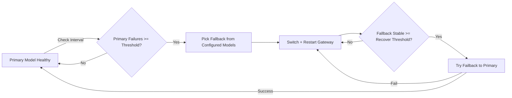

# OpenClaw Model Failover Guard



| English | 中文 |
|---|---|
| Automatic model failover + failback guard for OpenClaw. | OpenClaw 模型自动故障切换 + 自动切回守护。 |
| When primary model is unstable, switches to available fallback, then switches back after stability is restored. | 主模型不稳定时自动切到可用兜底，稳定后自动尝试切回主模型。 |

## Overview / 概览

| English | 中文 |
|---|---|
| Monitor model health on an interval. | 按固定间隔检测模型健康。 |
| If primary fails N times consecutively → failover. | 主模型连续失败 N 次后触发故障切换。 |
| Fallback is selected from **all configured models**. | 兜底模型从**全部已配置模型**中选择。 |
| Supports preferred fallback provider. | 支持设置优先 fallback provider。 |
| After fallback is stable for N checks → try failback. | 兜底稳定 N 次后尝试切回主模型。 |
| If failback test fails → revert to fallback immediately. | 切回失败会立即回退到兜底，防止抖动。 |

## Files / 文件

| Path | Purpose |
|---|---|
| `SKILL.md` | Skill definition / 技能定义 |
| `config.example.json` | Config template / 配置模板 |
| `scripts/failover.py` | Runtime guard script / 运行脚本 |

## Config / 配置

Copy `config.example.json` to `config.json`.

| Key | Description |
|---|---|
| `primaryModel` | Optional. Empty = use OpenClaw current default model / 可空，空则用当前默认主模型 |
| `preferredFallbackProvider` | Optional preferred fallback provider / 可选优先兜底 provider |
| `excludedProviders` | Providers excluded from fallback candidates / 不参与兜底的 provider |
| `failThreshold` | Consecutive failures before failover / 触发故障切换的连续失败阈值 |
| `recoverThreshold` | Stable checks before failback / 触发切回主模型的稳定阈值 |
| `checkIntervalSec` | Health check interval / 检查间隔秒数 |
| `testTimeoutSec` | Single test timeout / 单次测试超时 |

## Run / 运行

```bash
python3 scripts/failover.py once
python3 scripts/failover.py loop
```

## State & Logs / 状态与日志

- State / 状态：`~/.openclaw/failover-state.json`
- Log / 日志：`~/.openclaw/failover.log`

## License / 许可证

MIT
