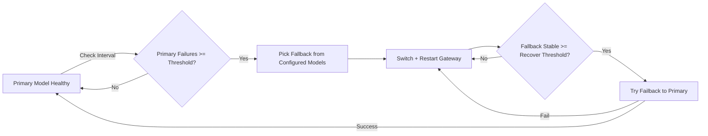

<script>
function setLang(en) {
  document.querySelectorAll('.en').forEach(e => e.style.display = en ? '' : 'none');
  document.querySelectorAll('.zh').forEach(e => e.style.display = en ? 'none' : '');
  document.querySelectorAll('.btn-en').forEach(e => e.style.fontWeight = en ? 'bold' : 'normal');
  document.querySelectorAll('.btn-zh').forEach(e => e.style.fontWeight = en ? 'normal' : 'bold');
}
</script>

<p>
<button class="btn-en" onclick="setLang(true)">English</button>
<button class="btn-zh" onclick="setLang(false)">中文</button>
</p>



<div class="en">

# OpenClaw Model Failover Guard

Automatic model failover + failback guard for OpenClaw.

When your primary model becomes unstable, this guard can switch to an available fallback model automatically, then switch back to the primary after stability is restored.

## Overview

- Monitor model health on an interval
- If primary fails N times consecutively → failover
- Fallback is selected from **all configured models**
- Supports preferred fallback provider
- After fallback is stable for N checks → try failback
- If failback test fails → revert to fallback immediately

## Files

| Path | Purpose |
|---|---|
| `SKILL.md` | Skill definition |
| `config.example.json` | Config template |
| `scripts/failover.py` | Runtime guard script |

## Config

Copy `config.example.json` to `config.json`.

| Key | Description |
|---|---|
| `primaryModel` | Optional. Empty = use OpenClaw current default model |
| `preferredFallbackProvider` | Optional preferred fallback provider |
| `excludedProviders` | Providers excluded from fallback candidates |
| `failThreshold` | Consecutive failures before failover |
| `recoverThreshold` | Stable checks before failback |
| `checkIntervalSec` | Health check interval (seconds) |
| `testTimeoutSec` | Single test timeout (seconds) |

## Run

```bash
python3 scripts/failover.py once
python3 scripts/failover.py loop
```

## State & Logs

- State: `~/.openclaw/failover-state.json`
- Log: `~/.openclaw/failover.log`

## License

MIT

</div>

<div class="zh" style="display:none;">

# OpenClaw Model Failover Guard

OpenClaw 模型自动故障切换 + 自动切回守护。

当主模型不稳定时，守护进程会自动切换到可用的兜底模型，并在稳定后自动尝试切回主模型。

## 概览

- 按固定间隔检测模型健康
- 主模型连续失败 N 次后触发故障切换
- 兜底模型从**全部已配置模型**中选择
- 支持设置优先 fallback provider
- 兜底稳定 N 次后尝试切回主模型
- 切回失败会立即回退到兜底，防止抖动

## 文件

| 路径 | 用途 |
|---|---|
| `SKILL.md` | 技能定义 |
| `config.example.json` | 配置模板 |
| `scripts/failover.py` | 运行脚本 |

## 配置

复制 `config.example.json` 为 `config.json`。

| 键 | 说明 |
|---|---|
| `primaryModel` | 可选；空则使用 OpenClaw 当前默认主模型 |
| `preferredFallbackProvider` | 可选的优先兜底 provider |
| `excludedProviders` | 不参与兜底的 provider 列表 |
| `failThreshold` | 触发故障切换的连续失败阈值 |
| `recoverThreshold` | 触发切回主模型的稳定检查阈值 |
| `checkIntervalSec` | 健康检查间隔（秒） |
| `testTimeoutSec` | 单次测试超时（秒） |

## 运行

```bash
python3 scripts/failover.py once
python3 scripts/failover.py loop
```

## 状态与日志

- 状态：`~/.openclaw/failover-state.json`
- 日志：`~/.openclaw/failover.log`

## 许可证

MIT

</div>