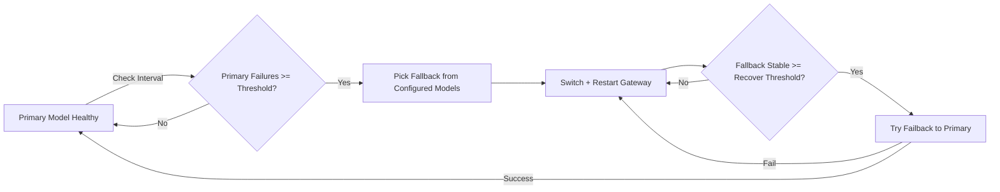

# OpenClaw Model Failover Guard



Automatic model failover + failback guard for OpenClaw.

OpenClaw 模型自动故障切换 + 自动切回守护。

When your primary model becomes unstable, this guard can switch to an available fallback model automatically, then switch back to the primary after stability is restored.

当主模型不稳定时，守护进程会自动切换到可用的兜底模型，并在稳定后自动尝试切回主模型。

---

## Overview / 概览

- Monitor model health on an interval
- 按固定间隔检测模型健康

- If primary fails N times consecutively → failover
- 主模型连续失败 N 次后触发故障切换

- Fallback is selected from **all configured models**
- 兜底模型从**全部已配置模型**中选择

- Supports preferred fallback provider
- 支持设置优先 fallback provider

- After fallback is stable for N checks → try failback
- 兜底稳定 N 次后尝试切回主模型

- If failback test fails → revert to fallback immediately
- 切回失败会立即回退到兜底，防止抖动

---

## Install / 安装

```bash
npx skills add https://github.com/BovmantH/openclaw-model-failover-guard.git --skill model-failover-guard
```

---

## Files / 文件

| Path | 路径 | Purpose | 用途 |
|---|---|---|---|
| `skills/model-failover-guard/SKILL.md` | `skills/model-failover-guard/SKILL.md` | Skill definition | 技能定义 |
| `skills/model-failover-guard/config.example.json` | `skills/model-failover-guard/config.example.json` | Config template | 配置模板 |
| `skills/model-failover-guard/scripts/failover.py` | `skills/model-failover-guard/scripts/failover.py` | Runtime guard script | 运行脚本 |

---

## Config / 配置

Copy `config.example.json` to `config.json`.

复制 `config.example.json` 为 `config.json`。

| Key | 键 | Description | 说明 |
|---|---|---|---|
| `primaryModel` | `primaryModel` | Optional. Empty = use OpenClaw current default model | 可选；空则使用 OpenClaw 当前默认主模型 |
| `preferredFallbackProvider` | `preferredFallbackProvider` | Optional preferred fallback provider | 可选的优先兜底 provider |
| `excludedProviders` | `excludedProviders` | Providers excluded from fallback candidates | 不参与兜底的 provider 列表 |
| `failThreshold` | `failThreshold` | Consecutive failures before failover | 触发故障切换的连续失败阈值 |
| `recoverThreshold` | `recoverThreshold` | Stable checks before failback | 触发切回主模型的稳定检查阈值 |
| `checkIntervalSec` | `checkIntervalSec` | Health check interval (seconds) | 健康检查间隔（秒） |
| `testTimeoutSec` | `testTimeoutSec` | Single test timeout (seconds) | 单次测试超时（秒） |

---

## Run / 运行

```bash
python3 skills/model-failover-guard/scripts/failover.py once
python3 skills/model-failover-guard/scripts/failover.py loop
```

---

## State & Logs / 状态与日志

- State / 状态：`~/.openclaw/failover-state.json`
- Log / 日志：`~/.openclaw/failover.log`

---

## Run as Systemd Service (Linux) / 作为 Systemd 服务运行

### Install service / 安装服务

```bash
mkdir -p ~/.config/systemd/user
cp skills/model-failover-guard/openclaw-model-failover.service ~/.config/systemd/user/
systemctl --user daemon-reload
```

### Enable & Start / 启用并启动

```bash
systemctl --user enable --now openclaw-model-failover
```

### Logs / 查看日志

```bash
journalctl --user -u openclaw-model-failover -f
```

---

## FAQ / 常见问题

**Q: 切不回主模型怎么办？**  
A: 检查日志 `~/.openclaw/failover.log`，确认主模型是否真的恢复了。可以手动运行 `python3 skills/model-failover-guard/scripts/failover.py once` 看测试结果。

**Q: 日志文件太大怎么办？**  
A: 可以定期清理或用 `logrotate`。例如：`echo "" > ~/.openclaw/failover.log`

**Q: 如何完全停止守护？**  
A: `systemctl --user stop openclaw-model-failover`（如果用了 systemd），或者直接 kill 进程。

**Q: 可以同时跑多个实例吗？**  
A: 不建议，会产生冲突。同一台机器只跑一个实例。

---

## License / 许可证

MIT License

Copyright © 2026 BovmantH

Permission is hereby granted, free of charge, to any person obtaining a copy of this software and associated documentation files (the "Software"), to deal in the Software without restriction, including without limitation the rights to use, copy, modify, merge, publish, distribute, sublicense, and/or sell copies of the Software, and to permit persons to whom the Software is furnished to do so, subject to the following conditions:

The above copyright notice and this permission notice shall be included in all copies or substantial portions of the Software.

THE SOFTWARE IS PROVIDED "AS IS", WITHOUT WARRANTY OF ANY KIND, EXPRESS OR IMPLIED, INCLUDING BUT NOT LIMITED TO THE WARRANTIES OF MERCHANTABILITY, FITNESS FOR A PARTICULAR PURPOSE AND NONINFRINGEMENT. IN NO EVENT SHALL THE AUTHORS OR COPYRIGHT HOLDERS BE LIABLE FOR ANY CLAIM, DAMAGES OR OTHER LIABILITY, WHETHER IN AN ACTION OF CONTRACT, TORT OR OTHERWISE, ARISING FROM, OUT OF OR IN CONNECTION WITH THE SOFTWARE OR THE USE OR OTHER DEALINGS IN THE SOFTWARE.

MIT 许可证

版权所有 © 2026 BovmantH

特此免费授予获得本软件及相关文档文件（"软件"）副本的任何人不受限制地处理本软件的权利，包括但不限于使用、复制、修改、合并、发布、分发、再许可和/或出售本软件副本，并允许获得本软件的人员在满足以下条件的情况下这样做：

上述版权声明和本许可声明应包含在本软件的所有副本或重要部分中。

本软件按"原样"提供，不提供任何形式的明示或暗示担保，包括但不限于对适销性、特定用途适用性和非侵权的担保。在任何情况下，作者或版权持有人均不对因本软件或使用或其他与本软件相关的交易而产生的任何索赔、损害或其他责任负责，无论是在合同、侵权或其他诉讼中。